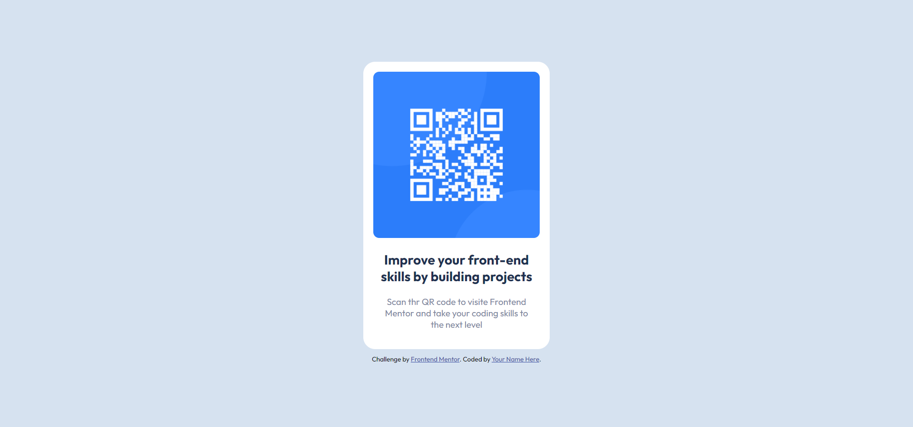

# Frontend Mentor - QR code component solution
This is a solution to the [QR code component challenge on Frontend Mentor](https://www.frontendmentor.io/challenges/qr-code-component-iux_sIO_H).

## Table of contents
- [Frontend Mentor - QR code component solution](#frontend-mentor---qr-code-component-solution)
  - [Table of contents](#table-of-contents)
    - [Screenshot](#screenshot)
    - [Links](#links)
    - [Built with](#built-with)
  - [Author](#author)

### Screenshot

### Links
- Solution URL: (https://github.com/M0hamedF/QR-Code)
- Live Site URL: (https://m0hamedf.github.io/QR-Code/) xxxx

### Built with
- Semantic HTML5 markup
- CSS custom properties
- CSS Flex

## Author
- Frontend Mentor - [@M0hamedF](https://www.frontendmentor.io/profile/M0hamedF)